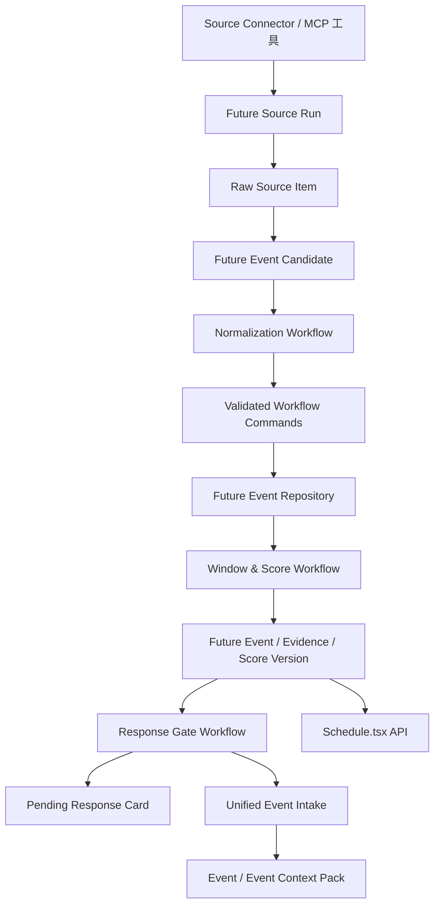

# 运营排期工作流化架构设计

本文档描述新后端中“运营排期”模块的可变规则架构。目标是让未来事件来源、标准化规则、评分规则、响应门槛和 Event 上下文生成能够通过工作流演进，避免每次业务规则调整都修改服务端代码。

关联业务文档：

- `hotspot-monitor-doc/_bmad-output/specs/spec-future-event-operations/SPEC.md`
- 前端页面：`hotspot-master/src/pages/Schedule/Schedule.tsx`
- 旧后端参考：`/Users/qmk/work/hotspot-monitor-v1/hotspot-monitor-server/src/future-events`

## 1. 设计结论

运营排期应采用“Connector / MCP 工具 + Markdown 工作流 + 稳定业务接口”的组合，而不是把所有能力都放进固定服务代码，也不是让大模型直接抓取并写库。

### 1.1 能放进工作流的部分

以下规则变化频繁，适合放到 Markdown 工作流：

- 未来事件候选的标题标准化。
- 主体、事件类型、计划动作识别。
- Confirmation Level、Schedule Precision、Expression Boundary 的判断建议。
- 证据支持事实和未确认事实拆分。
- 去重、合并、关联已有 Event 的建议。
- Event Window 的生成和更新建议。
- Heat Query 的生成、版本化和更新建议。
- Action Score 五维评分规则。
- 75 分待响应、90 分自动响应的触发判断。
- 生成或更新统一 Event Intake 的命令建议。

### 1.2 不能放进纯工作流的部分

以下部分必须由服务端和 Connector / MCP 工具执行：

- 调用官方来源、API、iCalendar、网页或文件。
- 认证、重试、限流、超时、来源健康检查。
- 原始数据保存和同步日志保存。
- 日期、时区、URL、来源类型等硬校验。
- 数据库写入、幂等更新、历史版本保存。
- 拒绝模型越权修改事实时间、来源链接和确认等级。

原因是 SPEC 明确要求：程序是来源事实和写入系统的唯一执行者，大模型不得直接抓取后写库，不得改写原始日期、时间或来源链接。

## 2. 总体架构



核心思路：

1. Connector 负责把不同来源的数据抓回来，并转换成结构化候选。
2. 工作流负责把结构化候选解释成业务决策。
3. 服务端负责校验工作流输出，并执行落库命令。
4. 前端只消费稳定 API，不关心底层来源和规则如何变化。

## 3. 模块边界

### 3.1 Source Connector 层

Source Connector 是平台数据采集能力。它可以是内置 TypeScript Connector，也可以是外部 MCP 工具。

首版来源：

| sourceType | 来源 | 推荐 Connector |
|---|---|---|
| `opm` | OPM 美国联邦假日 | `future.opm.fetchHolidays` |
| `bea` | BEA 发布时间表 | `future.bea.fetchSchedule` |
| `bls` | BLS 发布日历 iCal | `future.bls.fetchIcs` |
| `fomc` | FOMC 会议日历 | `future.fomc.fetchCalendar` |
| `manual` | 人工表单 / CSV | `future.manual.import` |

Connector 输出统一结构：

```json
{
  "sourceType": "bls",
  "sourceItemId": "bls-cpi-2026-09",
  "sourceUrl": "https://www.bls.gov/schedule/news_release/bls.ics",
  "retrievedAt": "2026-08-19T10:00:00.000Z",
  "title": "Consumer Price Index",
  "description": "CPI release",
  "startTime": "2026-09-10T12:30:00.000Z",
  "endTime": null,
  "timezone": "America/New_York",
  "raw": {}
}
```

Connector 只做技术解析和最低限度字段校验，不直接决定事件价值。

### 3.2 Candidate 层

`FutureEventCandidate` 是服务端传入工作流的结构化候选。它来自 Connector 输出，但会补充系统上下文：

- 当前自然年边界。
- 已存在 FutureEvent 候选列表。
- 已存在统一 Event 候选列表。
- 来源健康状态。
- 当前规则版本。
- 平台默认配置。

Candidate 必须保留原始来源 ID、原始 URL、原始时间和原始 payload。

### 3.3 Workflow 层

运营排期至少拆成三个工作流。

#### 3.3.1 `future-source-intake-normalization`

输入：单个或一批 `FutureEventCandidate`。

职责：

- 标准化标题、主体、事件类型。
- 判断事件是否属于当前自然年剩余范围。
- 给出 schedule precision 建议。
- 拆分 confirmed facts 和 unconfirmed facts。
- 生成 dedupe key。
- 建议 create / update / ignore。

输出命令示例：

```json
{
  "commands": [
    {
      "type": "upsert_future_event",
      "idempotencyKey": "future:bls:bls-cpi-2026-09",
      "dedupeKey": "bls:cpi:2026-09-10",
      "candidate": {
        "title": "美国 CPI 数据发布",
        "subject": "美国劳工统计局",
        "eventType": "经济数据发布",
        "confirmationLevel": "confirmed",
        "schedulePrecision": "exact_time",
        "expressionBoundary": "factual"
      },
      "evidenceRecords": []
    }
  ]
}
```

服务端必须校验：模型不得改写来源 URL、原始时间和来源 ID。若输出和原始候选冲突，拒绝该命令并记录 workflow error。

#### 3.3.2 `future-event-window-score`

输入：已落库 FutureEvent、Evidence、Heat Bucket、配置阈值。

职责：

- 生成或更新 monitoring / preheat / live / followUp 窗口。
- 生成 Heat Query。
- 计算 Action Score 五维分数。
- 给出 score reason。
- 保留 score version。

关键规则：

- 事件影响力 0-30。
- 证据可靠度 0-20。
- 热度动量 0-30。
- 时间紧迫度 0-10。
- 内容可执行性 0-10。
- 热度动量为 0 时总分最高 70。
- `internal_only` 和 `blocked` 不得进入对外生成。

工作流输出的是评分与窗口建议，服务端负责保存 `FutureEventScoreVersion` 和更新当前快照。

#### 3.3.3 `future-event-response-gate`

输入：FutureEvent 当前状态、最新 Action Score、Expression Boundary、历史响应记录。

职责：

- 判断是否首次或重新达到 75 分。
- 判断是否首次或重新达到 90 分。
- 判断创建待响应卡、自动 Event、忽略或仅更新上下文。
- 输出统一 Event Intake 命令。

输出命令类型：

- `create_pending_response`
- `create_event_intake`
- `update_event_context`
- `ignore_future_event_signal`

服务端执行时必须幂等：

- 75-89 分只创建或更新待响应卡，不自动生成内容。
- 90-100 分创建或复用唯一 `scheduled_auto_response` Event。
- 人工点击生成内容时创建或复用 `scheduled_manual_response` Event。
- 分数回落不撤销已启动流程。

## 4. 数据模型建议

新后端不要照搬旧后端把复杂对象全部塞进 `FutureEvent` JSON 字段。建议拆成平台可审计表。

### 4.1 Source 配置与运行

`future_source_config`

- `id`
- `source_type`
- `display_name`
- `connector_id`
- `enabled`
- `schedule`
- `variables`
- `created_at`
- `updated_at`

`future_source_run`

- `id`
- `source_config_id`
- `source_type`
- `status`
- `started_at`
- `finished_at`
- `item_count`
- `error`
- `input`
- `raw_summary`

`future_source_item`

- `id`
- `source_run_id`
- `source_type`
- `source_item_id`
- `source_url`
- `retrieved_at`
- `title`
- `description`
- `start_time`
- `end_time`
- `timezone`
- `raw`
- 唯一键：`source_type + source_item_id`

### 4.2 Future Event 主体

`future_event`

- `id`
- `title`
- `subject`
- `event_type`
- `dedupe_key`
- `fact_time`
- `fact_end_time`
- `timezone`
- `schedule_precision`
- `confirmation_level`
- `expression_boundary`
- `status`
- `related_event_id`
- `entry_mode`
- `current_score`
- `current_score_band`
- `rule_version`
- `created_at`
- `updated_at`

唯一键：`dedupe_key`。

### 4.3 证据与历史

`future_event_evidence`

- `id`
- `future_event_id`
- `source_item_id`
- `source_type`
- `url`
- `verified_at`
- `claims`
- `raw`

`future_event_change`

- `id`
- `future_event_id`
- `change_type`
- `before`
- `after`
- `reason`
- `workflow_run_id`
- `operator`
- `created_at`

用于保存改期、取消、时间确认、表达边界变化和人工修改。

### 4.4 窗口、热力与评分

`future_event_window`

- `id`
- `future_event_id`
- `window_type`
- `start_at`
- `end_at`
- `source`
- `version`
- `created_at`

`future_event_heat_query`

- `id`
- `future_event_id`
- `query`
- `version`
- `active`
- `created_at`

`future_event_heat_bucket`

- `id`
- `future_event_id`
- `query_version`
- `start_at`
- `end_at`
- `post_count`
- `source_type`
- `created_at`

`future_event_score_version`

- `id`
- `future_event_id`
- `total`
- `impact`
- `evidence`
- `heat_momentum`
- `time_urgency`
- `content_readiness`
- `band`
- `reasons`
- `workflow_run_id`
- `version`
- `created_at`

### 4.5 响应门禁

`future_response_card`

- `id`
- `future_event_id`
- `status`
- `score_at_creation`
- `reason`
- `created_at`
- `updated_at`

`future_event_response_link`

- `id`
- `future_event_id`
- `event_id`
- `entry_mode`
- `created_by`
- `created_at`

该表用于保证同一排期事件不会重复创建多个正式 Event。

## 5. 稳定 API 契约

前端 `Schedule.tsx` 继续使用稳定 API，不直接访问工作流。

### 5.1 页面读取

`GET /future-events?month=YYYY-MM`

返回 `FutureEvent[]`，兼容当前前端字段：

- `id`
- `title`
- `subject`
- `eventType`
- `factTime`
- `timezone`
- `schedulePrecision`
- `confirmationLevel`
- `expressionBoundary`
- `evidence`
- `windows`
- `actionScore`
- `heat`
- `relatedEventId`
- `entryMode`
- `ruleVersion`
- `createdAt`
- `updatedAt`

`GET /future-events?unassigned=true`

返回无事实时间或时间待确认的事件，用于未排期面板。

`GET /future-events/:id`

返回单个排期事件完整详情。

`GET /future-events/:id/heat`

返回 Heat Query、6 小时桶、最近 6h、前 6h、增长、关注强度、累计讨论量。

`GET /future-events/sources/status`

返回各来源启用状态、最近成功同步时间、下一次同步时间、错误信息。

### 5.2 人工操作

`POST /future-events`

人工添加单个未来事件。来源链接必填，默认：

- `confirmationLevel = needs_verification`
- `expressionBoundary = internal_only`
- `schedulePrecision = date` 或 `unknown`

`POST /future-events/import`

批量导入 CSV。服务端把每行转换为 manual candidate，再进入 normalization workflow，而不是直接写 `future_event`。

`PUT /future-events/:id`

人工校正字段。必须写入 `future_event_change`。

`DELETE /future-events/:id`

软删除或归档，不建议物理删除证据。

`POST /future-events/:id/respond`

人工触发响应。服务端必须先创建或复用统一 Event：

- kind = `content`：创建或复用 `scheduled_manual_response` Event，进入内容生成入口。
- kind = `campaign`：创建或复用 `scheduled_manual_response` Event，进入营销方案入口。

### 5.3 来源操作

`POST /future-events/sources/:source/resync`

触发单个来源重新同步。只影响该来源，不阻塞其他来源。

`GET /future-events/sources/config`

返回来源配置列表，后续设置页可用。

`PATCH /future-events/sources/:source/config`

修改来源变量、启用状态、频率、Connector ID。

## 6. 运行流程

### 6.1 自动来源同步

1. Scheduler 根据 `future_source_config.schedule` 触发。
2. Source Connector 获取官方来源数据。
3. 服务端写入 `future_source_run` 和 `future_source_item`。
4. 成功候选进入 `future-source-intake-normalization`。
5. 服务端校验 workflow output。
6. 执行 upsert / update / ignore 命令。
7. 写入 Evidence 和 Change Log。
8. 触发 `future-event-window-score`。
9. 触发 `future-event-response-gate`。
10. 若达到 90 分且允许响应，创建统一 Event Intake。

### 6.2 人工导入

1. 前端提交表单或 CSV。
2. 服务端校验来源链接必填。
3. 写入 manual source run 和 source item。
4. 进入 normalization workflow。
5. 默认 `needs_verification` 和 `internal_only`，除非人工后续确认。
6. 评分和响应门禁照常运行，但 `internal_only` 不允许对外生成。

### 6.3 热力监测

1. 当 FutureEvent 具备可监测时间窗口时，生成 Heat Query。
2. Scheduler 按 T-30、T-7、T-48h、T+48h、T+7d 切换频率。
3. Connector 获取 X Post Count 小时数据。
4. 服务端保存小时或 6 小时桶。
5. 触发 score workflow 更新热度动量。
6. 触发 response gate workflow。

Twitter key 未就绪时，该流程可以先保留接口和表，不生成假热力数据。

### 6.4 热搜关联

当 X 热搜榜生成或更新 Event 时，服务端用主体、关键词和时间窗口召回 FutureEvent。

- 同一核心事实：只更新同一 Event 上下文。
- 新动作、新结果、反转：创建关联 Event。
- 热搜上下文不提高 Confirmation Level。
- 未命中热搜不阻断排期响应。

## 7. 工作流输出校验原则

所有 Markdown 工作流必须配套 JSON Schema。服务端只执行通过校验的命令。

校验规则：

- `sourceUrl` 必须来自原始 source item。
- `factTime` 只能来自原始 source item 或人工输入。
- `confirmationLevel` 不能被模型无证据提高。
- `expressionBoundary` 不能越过 Confirmation Level 允许范围。
- `schedulePrecision = exact_time` 必须有来源支持的精确时间。
- `idempotencyKey` 必须存在。
- `dedupeKey` 必须稳定。
- `commands[]` 允许为空，代表本轮只观察或忽略。

失败处理：

- 单条命令失败不影响同批其他命令。
- Workflow 输出非法时，该 source run 标记为 partial 或 failed。
- 技术失败最多重试 3 次。
- 来源冲突不算技术失败，应生成 `needs_verification` 或 change record。

## 8. 与现有前端页面的对应关系

`Schedule.tsx` 当前已经具备首版运营视图需要的主要入口：

- 月历。
- 本月事件数。
- 官方确认数。
- 进入预热数。
- 时间待确认数。
- Confirmation Level 筛选。
- Source Type 筛选。
- Action Score Band 筛选。
- 事件详情。
- Heat Panel。
- Source Status Panel。
- 未排期事件面板。
- 添加事件。
- CSV 批量导入。
- 生成内容。
- 生成营销方案。

因此前端短期不需要大改。后端需要保证返回结构稳定，并补齐真实数据。

后续可以新增两个设置入口：

1. 未来事件来源配置。
2. 运营排期工作流配置。

运营人员不直接编辑数据库规则，而是通过助手修改 Markdown 工作流和来源配置。

## 9. 与统一 Event 系统的关系

运营排期不能绕过 Event 直接生成内容。

排期进入下游必须创建或复用 Event Intake：

- `entryMode = scheduled_manual_response`
- `entryMode = scheduled_auto_response`

Event Context Pack 应包含：

- 排期事件标题。
- 主体。
- 事件类型。
- 事实时间和时区。
- Schedule Precision。
- Confirmation Level。
- Expression Boundary。
- Evidence Records。
- Event Windows。
- Heat Query 和 Heat Buckets。
- Action Score 和评分原因。
- 相关热搜上下文。
- 已确认事实与未确认事实。

下游内容生成和营销方案只读取 Event Context Pack，不直接读取 FutureEvent 私有表。

## 10. 首期实现顺序建议

首期不需要一次性做完全部官方 Connector。建议按以下顺序：

1. 建表：Future Source、Future Event、Evidence、Window、Heat、Score、Response Link。
2. 补稳定 API：让 `Schedule.tsx` 不再依赖旧后端。
3. 实现 manual import：人工表单和 CSV 先进入 source item，再经过 normalization workflow。
4. 实现 normalization workflow runtime：Markdown + JSON Schema + command executor。
5. 实现 window & score workflow：先不依赖真实热力，热度动量为 0。
6. 实现 response gate workflow：支持人工响应和 75/90 分门禁。
7. 接入一个官方来源 Connector：优先 BLS iCal，因为结构化程度最高。
8. 接入 Source Status Panel。
9. 接入热力监测接口，Twitter key 未就绪时只显示无数据状态。
10. 逐步接入 OPM、BEA、FOMC。

## 11. 设计取舍

### 11.1 为什么不把来源也做成 Markdown 工作流

来源抓取需要认证、限流、错误处理、解析格式、数据落库和重试。纯工作流无法稳定承担这些执行职责，也不符合 SPEC 对事实边界的要求。

### 11.2 为什么不沿用旧后端固定 service

旧后端实现快，但规则写死。未来来源、评分、窗口和响应门槛变化时都要改服务端代码，不符合当前系统目标。

### 11.3 为什么服务端仍然要有业务接口

前端、助手和后续内容模块需要稳定契约。工作流可以变，但 API 和数据库执行边界不能随意漂移。

## 12. 验收标准

架构实现后应满足：

- 新增或修改来源不影响前端 API。
- 修改评分、窗口、去重、响应门槛时，只改工作流和 schema，不改业务接口。
- 工作流不能直接写库，只能输出命令。
- 服务端拒绝非法工作流输出。
- 人工导入、官方来源、自动同步都经过同一 Future Event Candidate 流程。
- 所有进入内容或营销链路的排期事件都先创建或复用统一 Event。
- 历史证据、旧时间、旧评分和工作流版本可追溯。
- 来源失败不会伪造事件，也不会覆盖成功数据。
